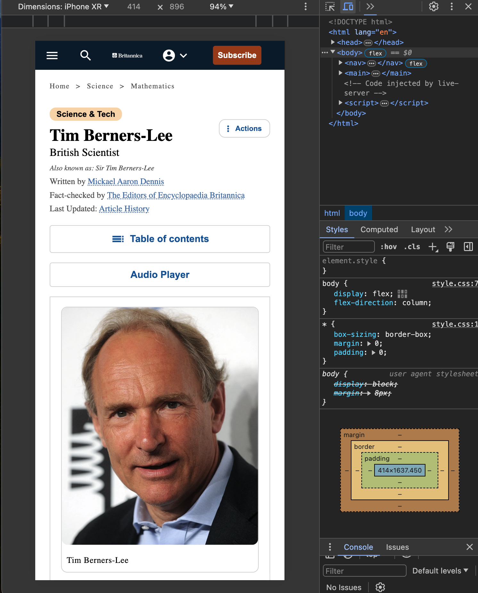
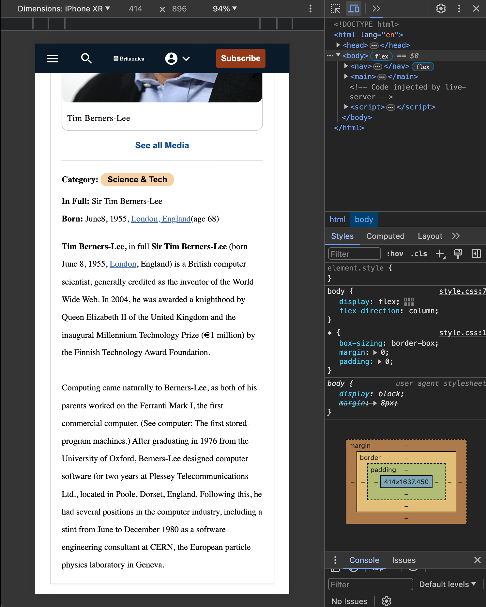

# Tim Berners Lee's Challenge
## This challenge consolidates what I've learned so far regarding the followings:

- HTML
- CSS
- git/github
- Markdown

### Feature
 - replicate an existing page
 - mobile first design - fully responsive

#### vistit site [here](https://brieucdegoussencourt.github.io/tim-berners-lee/)

### Screenshots - Mobile version

